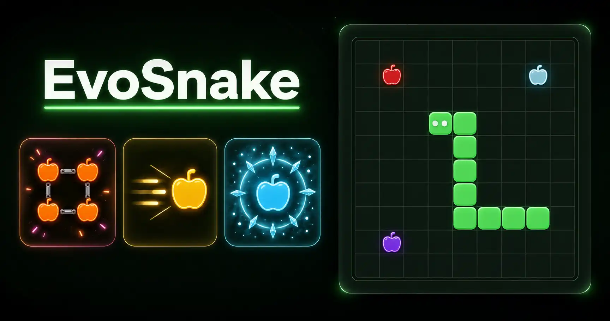

# EvoSnake

  

English | [繁體中文](README.zh-TW.md)

EvoSnake is a fast browser snake game with special apples, surprise live events, and leaderboard pressure. It starts simple, then keeps changing the rules just enough to stay tense.

<a style="background: #222; color: white; width: fit-content; padding: 4px 16px; border-radius: 4px; outline: 2px solid #54d978; cursor: pointer; text-decoration: none" href="https://snake.mengche.dev">
  <b>Play the Game</b>
</a>

## Features

- **Special Apples**  
  Every apple changes the run in a meaningful way, from speed boosts and slowdown effects to ghost movement, shrinking, bonus points, and rotten penalties.

- **Live Events**  
  Mid-run events like Bonus Chain, Gold Rush, and Ice Age temporarily reshape the board and force players to react instead of repeating the same pattern.

- **Multiple Difficulties**  
  Each difficulty changes map size, pace, and apple pressure, so the game stays approachable for new players and punishing for experienced ones.

- **Leaderboard Competition**  
  Scores are saved, so each run has weight and players have a reason to keep pushing for cleaner, higher-scoring games.

- **Desktop and Mobile Controls**  
  EvoSnake supports keyboard and touch play, making it usable on both desktops and mobile devices.

## Design Concept

The core goal of this game is to create an experience that is both **fun** and **easy to pick up**.

Based on these two principles, I preserved the basic controls of the classic Snake game, so players do not need to relearn how to play. Instead, the innovation focuses on the game mechanics themselves, adding more variety to the simple core gameplay.

During the early planning stage, I wanted the new mechanics to remain **intuitive and easy to understand**. At one point, the design included more than 10 different apple types and multiple in-game events. However, during implementation and iteration, I found that having too many elements increased the player’s memory burden and made the game less approachable.

As a result, the final version was narrowed down to 7 apple types and 3 in-game events. This design keeps the gameplay simple while still providing enough variety and freshness.
